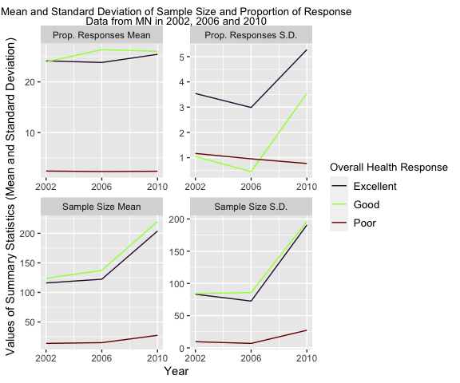

pubh7462\_hw2\_mjdasilv
================
Maykon da Silva
2/7/2022

``` r
# Reading in the dataset with relative path
brfss.df <- read_csv("./data/brfss_smart_2010.csv")
```

# Problem 3. BRFSS SMART 2002-2010

## 3.1 Data Exploration and Cleaning

``` r
# Tidying up the data (Cleaning)
brfss.tidy <- brfss.df %>%
  clean_names() %>%
  filter(topic %in% "Overall Health") %>%
  rename(state = locationabbr, locations = locationdesc, prop_responses = data_value) %>%
  separate(locations, c("state_abb", "county"), sep = " - ") %>%
  select(year, state, county, response, sample_size, prop_responses) %>%
  mutate(year = as.factor(year))
```

## 3.2 Data Description

The BRFSS SMART 2002-2010 is a County Prevalence lad line only data set,
which can be used to identify emerging health problems, establish and
track health objectives, and develop and evaluate public health policies
and programs. The original data set contains 23 variables but for this
assignment only Year, State, County, Response, Sample Size and
Proportion of Responses will be utilized to assess the “Overall Health”
topic. The Overall Health topic contains five options of responses:
Excellent, Very Good, Good, Fair, and Poor and will be described as
“response” in the following paragraphs.

``` r
# Determining the number of rows and columns from the penguins data set
brfss.tidy_rows <- nrow(brfss.tidy)
brfss.tidy_columns <- ncol(brfss.tidy)
```

Therefore, the data set contains:

  - 6 variables: year (from 2002 to 2010), state (all 50 US states),
    county (counties with 500 or more respondents), response (5 options:
    Excellent, Very Good, Good, Fair and Poor), sample size
    (representing the number of respondents/observations), and
    proportion of responses (which represents the relationship between
    number of observations for each possible response and the total
    number of observations for a specific county in percentage).

  - 10625 observations/rows: each observation is a combination of all 6
    variables and their levels (as described above). As an example, row
    1 describes the the sample size and proportion of responses for
    Jefferson County in Alabama (AL) in 2010 for the Excellent response.
    In this case, 94 observations were accounted as Excellent response,
    which represents 18.9% of all observations for Jefferson County.

## 3.3 Do Data Science

### 3.3.1 In the year 2004, which states were observed at 6 locations?

``` r
# Determining the number of states observed at 6 locations in 2004 using distinct()
brfss.tidy %>%
  filter(year %in% 2004) %>%
  distinct(state, county) %>%
  group_by(state) %>%
  rename(State = state) %>%
  summarise(Observations = n()) %>%
  filter(Observations %in% 6) %>%
  knitr::kable(caption = "States observed at 6 locations in 2004", 
               format  = "html")
```

<table>

<caption>

States observed at 6 locations in 2004

</caption>

<thead>

<tr>

<th style="text-align:left;">

State

</th>

<th style="text-align:right;">

Observations

</th>

</tr>

</thead>

<tbody>

<tr>

<td style="text-align:left;">

CO

</td>

<td style="text-align:right;">

6

</td>

</tr>

<tr>

<td style="text-align:left;">

CT

</td>

<td style="text-align:right;">

6

</td>

</tr>

<tr>

<td style="text-align:left;">

MD

</td>

<td style="text-align:right;">

6

</td>

</tr>

<tr>

<td style="text-align:left;">

NM

</td>

<td style="text-align:right;">

6

</td>

</tr>

<tr>

<td style="text-align:left;">

SC

</td>

<td style="text-align:right;">

6

</td>

</tr>

<tr>

<td style="text-align:left;">

TX

</td>

<td style="text-align:right;">

6

</td>

</tr>

<tr>

<td style="text-align:left;">

UT

</td>

<td style="text-align:right;">

6

</td>

</tr>

<tr>

<td style="text-align:left;">

VT

</td>

<td style="text-align:right;">

6

</td>

</tr>

</tbody>

</table>

As shown by the table above, eight states were observed at six locations
in 2004: Colorado (CO), Connecticut (CT), Maryland (MD), New Mexico
(NM), South Carolina (SC), Texas (TX), Utah (UT), and Vermont (VT).

### 3.3.2 Make a “spaghetti plot” that shows the number of observed locations in each state from 2002 to 2010. Which state has the highest mean number of locations over this period?

``` r
# Making a spaghetti plot
brfss.tidy %>%
  select(year, state, county) %>%
  distinct(year, state, county) %>%
  group_by(year, state) %>%
  summarise(n = n()) %>%
  mutate(state = fct_reorder(.f = state, .x = n, .fun = "mean", .desc = TRUE),
         year = year %>%
           as.character() %>%
           as.numeric()
  ) %>%
  ggplot(aes(x = year, y = n, colour = state)) +
  geom_line() +
  labs(
    x     = "Year",
    y     = "Number of Locations Observed",
    title = "Observed Locations (Counties) per State from 2002 - 2010"
  ) +
  scale_x_continuous(breaks = 2002:2010) +
  scale_colour_viridis_d("State (Desc. Average Observations)", option = "turbo") +
  theme(
    legend.text  = element_text(size = 6),
    legend.title = element_text(size = 8))
```


As shown by the “spaghetti plot” above, Pennsylvania is the state with
the highest number of locations observed from 2002 to 2010. In addition,
most of the states with the highest average of locations observed in
this period are located in the US East Cost. Furthermore, the majority
of the states with the lowest average of locations observed in this
period are among the less populated states in the US. This is probably
correlated to the size of the counties that make up each state. Since
only counties with at least 500 or more respondents were selected to
represent this data set, less populated states might have smaller (less
populated) counties, which reduces the amount of locations being
surveyed.

### 3.3.3 Make a table showing, for the years 2002, 2006, and 2010, the mean and standard deviation of sample size and proportion of Excellent, Good, and Poor responses across locations in MN.

``` r
# Making a table for MN in 2002, 2006 and 2010 with the required measurements
brfss.tidy %>%
  filter(year     %in% c("2002", "2006", "2010"),
         state    %in% "MN",
         response %in% c("Excellent", "Good", "Poor")) %>%
  group_by(year, response) %>%
  summarise(
    across(
      contains(c("sample", "prop")),
        list(mean = mean, sd = sd), na.rm = TRUE,
        .names = "{.col}_{.fn}"
  )
) %>%
  mutate(across(where(is.numeric), round, 2)) %>%
  knitr::kable(caption = "Summary of Sample Size and Prop. Responses for MN in 2002, 2006, and 2010", 
               format  = "html")
```

<table>

<caption>

Summary of Sample Size and Prop. Responses for MN in 2002, 2006, and
2010

</caption>

<thead>

<tr>

<th style="text-align:left;">

year

</th>

<th style="text-align:left;">

response

</th>

<th style="text-align:right;">

sample\_size\_mean

</th>

<th style="text-align:right;">

sample\_size\_sd

</th>

<th style="text-align:right;">

prop\_responses\_mean

</th>

<th style="text-align:right;">

prop\_responses\_sd

</th>

</tr>

</thead>

<tbody>

<tr>

<td style="text-align:left;">

2002

</td>

<td style="text-align:left;">

Excellent

</td>

<td style="text-align:right;">

116.00

</td>

<td style="text-align:right;">

83.27

</td>

<td style="text-align:right;">

24.15

</td>

<td style="text-align:right;">

3.54

</td>

</tr>

<tr>

<td style="text-align:left;">

2002

</td>

<td style="text-align:left;">

Good

</td>

<td style="text-align:right;">

123.75

</td>

<td style="text-align:right;">

84.26

</td>

<td style="text-align:right;">

23.95

</td>

<td style="text-align:right;">

1.05

</td>

</tr>

<tr>

<td style="text-align:left;">

2002

</td>

<td style="text-align:left;">

Poor

</td>

<td style="text-align:right;">

13.75

</td>

<td style="text-align:right;">

9.57

</td>

<td style="text-align:right;">

2.40

</td>

<td style="text-align:right;">

1.17

</td>

</tr>

<tr>

<td style="text-align:left;">

2006

</td>

<td style="text-align:left;">

Excellent

</td>

<td style="text-align:right;">

122.33

</td>

<td style="text-align:right;">

72.62

</td>

<td style="text-align:right;">

23.83

</td>

<td style="text-align:right;">

2.99

</td>

</tr>

<tr>

<td style="text-align:left;">

2006

</td>

<td style="text-align:left;">

Good

</td>

<td style="text-align:right;">

137.33

</td>

<td style="text-align:right;">

85.82

</td>

<td style="text-align:right;">

26.37

</td>

<td style="text-align:right;">

0.45

</td>

</tr>

<tr>

<td style="text-align:left;">

2006

</td>

<td style="text-align:left;">

Poor

</td>

<td style="text-align:right;">

15.00

</td>

<td style="text-align:right;">

6.93

</td>

<td style="text-align:right;">

2.30

</td>

<td style="text-align:right;">

0.95

</td>

</tr>

<tr>

<td style="text-align:left;">

2010

</td>

<td style="text-align:left;">

Excellent

</td>

<td style="text-align:right;">

203.80

</td>

<td style="text-align:right;">

190.60

</td>

<td style="text-align:right;">

25.44

</td>

<td style="text-align:right;">

5.28

</td>

</tr>

<tr>

<td style="text-align:left;">

2010

</td>

<td style="text-align:left;">

Good

</td>

<td style="text-align:right;">

220.00

</td>

<td style="text-align:right;">

196.10

</td>

<td style="text-align:right;">

26.04

</td>

<td style="text-align:right;">

3.55

</td>

</tr>

<tr>

<td style="text-align:left;">

2010

</td>

<td style="text-align:left;">

Poor

</td>

<td style="text-align:right;">

27.40

</td>

<td style="text-align:right;">

27.32

</td>

<td style="text-align:right;">

2.36

</td>

<td style="text-align:right;">

0.77

</td>

</tr>

</tbody>

</table>

As shown by the table above, “in 2002, 2006, and 2010,”Good" was the
response of Overall Health with the highest average sample size,
followed by “Excellent” and “Poor”, respectively. This raises two main
questions to me:

  - 1)  Was a lower sample size mean verified for Poor Overall Health
        because people with poor overall health were not willing to be
        surveyed or because they could not do it?

  - 2)  Maybe it is the opposite. Maybe most people in MN are healthier
        and that is why the sample size mean for poor overall health was
        so low in the state.

In addition, a similar trend was verified for the average proportion of
responses. However, it is important to point out that the Standard
Deviation for Excellent and Good are substantially higher than the
Standard Deviation of Poor for the sample size mean, which means that
the data for excellent and good are more dispersed (or there is more
variation) in relation to the mean than for poor.

### 3.3.4 Create a ggplot that communicates the results/trends from the table above and stands on its own

``` r
brfss.tidy %>%
  filter(year     %in% c("2002", "2006", "2010"),
         state    %in% "MN",
         response %in% c("Excellent", "Good", "Poor")) %>%
  group_by(year, response) %>%
  summarise(
    across(
      contains(c("sample", "prop")),
        list(mean = mean, sd = sd), na.rm = TRUE,
        .names = "{.col}_{.fn}"
  )
) %>%
  pivot_longer(cols      = 3:6, 
               names_to  = "variable_mean.sd", 
               values_to = "value") %>%
  mutate(fct_relevel(response, c("Excellent", "Good", "Poor")),
         year = year %>%
           as.character() %>%
           as.numeric()) %>%
  mutate(variable_mean.sd = recode(variable_mean.sd, 
                                   sample_size_mean    = "Sample Size Mean", 
                                   sample_size_sd      = "Sample Size S.D.",
                                   prop_responses_mean = "Prop. Responses Mean",
                                   prop_responses_sd   = "Prop. Responses S.D.")) %>%
  ggplot(aes(x = year, y = value, colour = response)) +
  geom_line() +
  labs(x        = "Year", 
       y        = "Values of Summary Statistics (Mean and Standard Deviation)", 
       title    = "Mean and Standard Deviation of Sample Size and Proportion of Response",
       subtitle = "Data from MN in 2002, 2006 and 2010") +
  facet_wrap(~variable_mean.sd, scales = "free", ncol = 2, labeller = ) +
  scale_colour_viridis_d("Overall Health Response", option = "turbo") +
  scale_x_continuous(breaks = seq(from = 2002, to = 2010, by = 4)) +
  theme(
    legend.text   = element_text(size = 10),
    legend.title  = element_text(size = 10),
    plot.title    = element_text(hjust = 0.5, size = 10),
    plot.subtitle = element_text(hjust = 0.5, size = 10))
```


